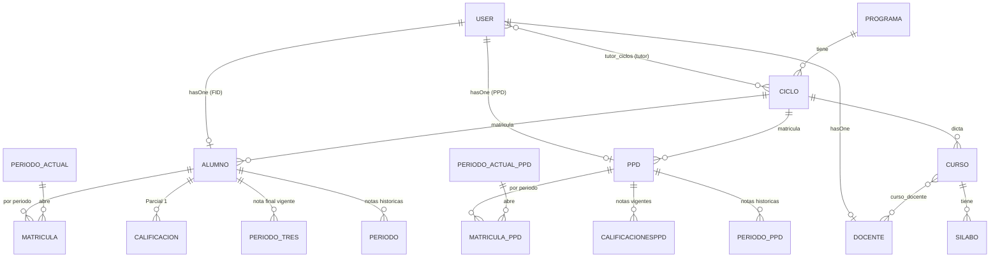

# Documentación técnica del sistema Puklla — para desarrollo de app móvil Flutter

> Este documento explica cómo funciona el sistema web actual (Laravel) para que un equipo de
> desarrollo Flutter, sin conocimiento previo del proyecto, pueda entender el dominio, los roles,
> los datos y diseñar/construir la API REST que consumirá la app móvil híbrida.
>
> Última revisión: 2026-09-01. Basado en el código real del repositorio a esa fecha.

---

## 1. Qué es el sistema

Puklla es la plataforma de gestión académica de un instituto de formación docente, con dos
programas de estudios en paralelo:

- **FID** (Formación Inicial Docente) — alumnos regulares, rol `alumno`, modelo `Alumno`.
- **PPD** (Profesionalización Docente) — alumnos del programa de profesionalización, rol
  `alumnoB`, modelo `ppd` (tabla `ppds`).

Ambos programas comparten la misma estructura académica (Programas → Ciclos → Cursos →
Docentes) pero tienen tablas y flujos de matrícula/calificaciones **separados y no
intercambiables**. Esto es la fuente de complejidad más importante del sistema y hay que
tenerlo presente en cada endpoint que se diseñe: casi todo se duplica en versión FID y versión
PPD.

Además del núcleo académico, el sistema incluye: matrícula por período con verificación de
voucher de pago, sílabos, incidencias, tutorías individuales y buzón de sugerencias (con acceso
público vía QR), un LMS de cursos especiales asincrónicos (primer curso: Quechua), bolsa de
trabajo, comunicados, postulación/admisión, y un chatbot institucional.

## 2. Stack tecnológico actual

- **Backend**: Laravel 10 (`^10.10`), PHP `^8.1`.
- **Frontend actual**: Blade + jQuery/JS clásico (no SPA, no API). Sesión web (`guard: web`).
- **Roles y permisos**: `spatie/laravel-permission ^6.3`.
- **Tokens de API**: `laravel/sanctum ^3.3` está **instalado pero sin usar** — no hay ningún
  endpoint que emita tokens (`createToken()` no aparece en ningún lugar del código). Es el
  candidato natural para autenticar la app Flutter, pero hay que construirlo desde cero.
- **PDF**: `barryvdh/laravel-dompdf` (fichas de matrícula, sílabos, certificados).
- **QR**: `simplesoftwareio/simple-qrcode` (formularios públicos de tutoría/sugerencias).
- **Colas**: `QUEUE_CONNECTION=database`. Varias notificaciones (`ShouldQueue`) requieren que
  corra `php artisan queue:work` en el servidor — en producción esto se ha resuelto con cron
  (ver advertencias, sección 8).
- **Correo**: SMTP (Gmail), Mailables síncronos y notificaciones con canal `mail` + `database`.

## 3. Roles del sistema (Spatie)

| Rol | Quién es | Perfil relacionado |
|---|---|---|
| `super-admin` | Control total, incluye gestión de usuarios y bitácora de accesos | — |
| `admin` | Administración general (incluye funciones de "cobranzas": no existe un rol separado) | — |
| `adminB` | Administrador del módulo Bolsa de Trabajo | — |
| `docente` | Profesor, dicta cursos FID y/o PPD | `Docente` |
| `tutor` | Tutor de uno o más ciclos (atiende incidencias/tutorías/sugerencias del ciclo) | usa `docente` si lo tiene |
| `alumno` | Alumno del programa FID | `Alumno` |
| `alumnoB` | Alumno del programa PPD | `ppd` (tabla `ppds`) |
| `inhabilitado` | Cuenta deshabilitada/retirada — se redirige a una vista de aviso, no puede operar | — |

**Importante sobre Docente/Tutor**: en el código, el rol `tutor` **no obliga** a que el usuario
también tenga el rol `docente` — son checkboxes independientes en el formulario de admin y no
hay validación de servidor que lo impida. La tabla `tutor_ciclos` vincula `user_id` directo con
`ciclo_id`, sin pasar por `docentes.id`. Sin embargo, el panel de tutor (`TutorController`) lee
`$user->docente` sin verificar null, asumiendo por convención que todo tutor es también docente.
**Es una regla de negocio, no una restricción de base de datos.** Si la app móvil va a mostrar
"mis ciclos como tutor", conviene decidir explícitamente si se exige tener perfil de docente o
si se tolera que sea null.

Un mismo `User` puede, en teoría, combinar varios roles (ej. `docente` + `tutor`). Los roles
`alumno` y `alumnoB` no deberían coexistir en la práctica (son dos programas distintos) pero no
hay nada en el código que lo impida a nivel de roles.

## 4. Autenticación — estado actual y lo que falta para la API

- Guard único `web`, un solo modelo `User` para todos los roles.
- Login web tradicional (`laravel/ui`, controladores en `app/Http/Controllers/Auth/`).
- Existe un login inline por AJAX (`AlumnoAuthController::loginInline`) usado en los formularios
  públicos con QR, pero **solo acepta cuentas con rol `alumno` (FID)** — no sirve para PPD ni
  docentes.
- **Para la app Flutter hace falta construir**:
  1. Endpoint `POST /api/login` que valide credenciales y devuelva un token Sanctum
     (`$user->createToken(...)`).
  2. Endpoint `POST /api/logout` que revoque el token actual.
  3. Middleware `auth:sanctum` en todas las rutas de `routes/api.php` que requieran sesión.
  4. Decidir expiración/revocación de tokens (Sanctum no expira tokens por defecto).
  5. Manejar el rol `inhabilitado` explícitamente en el login de la API (hoy solo redirige a una
     vista web).

## 5. Módulo de Calificaciones (el más relevante para la Cotización 1)

Este es el módulo más importante para la app móvil de "calificaciones en tiempo real" y también
el más complejo del sistema. **No existe un modelo único de "notas"**: hay una tabla de trabajo
en vivo mientras el período está abierto, y una tabla de archivo histórico una vez que el
período se cierra. El flujo es distinto para FID y para PPD.

### Flujo FID (rol `alumno`)

1. **`Calificacion`** (tabla `calificacions`) — notas del Parcial 1, por `alumno_id` + `curso_id`
   (campos `valoracion_1/2/3`, `valoracion_curso`, `calificacion_curso`, `calificacion_sistema`).
2. Al publicar el Parcial 1, se archiva a **`PeriodoUno`** (tabla `periodouno`).
3. El Parcial 2 se guarda directo en **`PeriodoDos`** (tabla `periodo_dos`).
4. La nota final del curso (Período de Desempeño) se guarda en **`PeriodoTres`**
   (tabla `periodo_tres`) — esta es la nota "vigente" mientras el período académico sigue
   abierto.
5. Cuando el admin **cierra** el `PeriodoActual`, el sistema copia `PeriodoTres` a la tabla
   histórica **`Periodo`** (tabla `periodos`), asociada a `periodo_actual_id`. Esta es la tabla
   que permite a un alumno ver notas de **períodos anteriores**.

### Flujo PPD (rol `alumnoB`)

1. Tabla de trabajo: **`Calificacionesppd`** (tabla `calificacionesppds`) — modelo más rico:
   hasta 3 competencias, con subcampos de Proceso, Producto Final y Promedio General, más
   `nivel_desempeno`, `calificacion_curso`, `calificacion_sistema`, `observaciones`.
2. Snapshot histórico al cerrar el período: tabla **`PeriodoPpd`** (`periodo_ppds`), asociada a
   `PeriodoActualPpd`.

### Regla práctica para el endpoint "mis notas"

Un endpoint de "notas del alumno" (FID o PPD) debe combinar **dos fuentes** según si el período
está abierto o cerrado:

- Período **abierto** (actual) → leer de la tabla de trabajo en vivo (`PeriodoTres` /
  `Calificacionesppd`).
- Período **cerrado** (histórico) → leer del snapshot (`Periodo` / `PeriodoPpd`).

Esto ya está resuelto en el sistema web actual en `AlumnoController::calificaciones()` (FID) y
`PpdController::calificacionesppd()` (PPD) — la lógica de la API debe replicar ese mismo
comportamiento, no reinventarlo.

### ⚠️ Advertencia — ruta rota detectada

La ruta `calificacionesPPD` (`routes/admin.php`) apunta a un método `PpdController::calificaciones`
que **no existe** en el controlador. Es código muerto/roto — no replicar esa ruta como
referencia sin antes definir la lógica correcta con el equipo funcional.

### ⚠️ Advertencia — significado de campos no documentado

No hay documentación de negocio sobre la diferencia exacta entre `valoracion_1/2/3`,
`calificacion_curso` y `calificacion_sistema`. Antes de exponer estos campos en la API,
validar su significado con el equipo académico para no mostrar el dato equivocado en la app.

## 6. Módulos completos del sistema (para la Cotización 2 — alcance total)

### Público, sin login (acceso directo o vía QR impreso)
- Páginas institucionales (nosotros, programas, admisión, trámites).
- Postulación/inscripción a FID y PPD.
- Bolsa de trabajo: publicar oferta y postularse.
- Libro de Reclamaciones.
- Reporte de incidencias.
- Solicitud de tutoría individual y buzón de sugerencias (anónimo opcional) — pensados para
  escanear un QR físico en el instituto y llenar un formulario corto sin cuenta.

### Alumno FID (`alumno`)
- Perfil y ficha de matrícula (PDF).
- Matrícula por período (formulario corto + subida de voucher de pago).
- Calificaciones (actuales e históricas — ver sección 5).
- Cursos y avance por ciclo.
- Cursos Especiales asincrónicos (LMS): inscripción, lecciones (texto/audio/video), ejercicios,
  progreso.
- Comunicados.
- Chatbot institucional (PukllaBot).

### Alumno PPD (`alumnoB`)
- Registro/ficha técnica PPD.
- Matrícula PPD por período (con voucher).
- Calificaciones PPD (estructura por competencias).

### Docente
- Perfil y blog docente.
- Listado de alumnos por curso (FID y PPD).
- Calificar cursos (FID y PPD).
- Repositorio y gestión de sílabos (currículo: competencias, capacidades, enfoques, estándares,
  proyectos, unidades, rúbricas) con exportación PDF.
- Reportar incidencias de alumnos.
- Gestión de contenido de Cursos Especiales (si además dicta el LMS): niveles, unidades,
  lecciones, ejercicios, audio.

### Tutor
- Dashboard con sus ciclos asignados.
- Atención de incidencias, tutorías y sugerencias de esos ciclos.
- Generación de posters/QR imprimibles para tutoría y sugerencias.

### Admin / Super-admin
- CRUD de usuarios y asignación de roles.
- Gestión de programas, ciclos, cursos.
- Gestión de períodos académicos (`PeriodoActual`/`PeriodoActualPpd`) — abrir/cerrar, generar
  snapshots de calificaciones.
- Verificación manual de vouchers de matrícula (FID y PPD).
- Gestión de postulantes (admisión) — incluye conversión de postulante a alumno.
- Exportar Excel de alumnos/PPD, generación de carnet.
- Comunicados, Minkarikuy (eventos destacados).
- Bolsa de trabajo (moderación de ofertas).
- Bitácora de accesos y sesiones activas (solo super-admin).

## 7. Modelo de datos — entidades principales

*(Diagrama simplificado — omite tablas de currículo detallado, postulación, LMS, incidencias,
etc. ya listadas en la sección 6.)*

## 8. Notificaciones y correo

- **Mailables** (`app/Mail/`): confirmación de inscripción (FID/PPD), registro genérico, libro
  de reclamaciones, incidencia, tutoría, sugerencia.
- **Notifications** nativas de Laravel (`app/Notifications/`, canal `database` + `mail`):
  `IncidenciaCreada`, `TutoriaCreada`, `SugerenciaCreada` — alimentan la tabla `notifications`
  que ya usa el sistema web para el ícono de campanita. **Es reutilizable tal cual para la app
  móvil** (polling o push sobre la misma tabla) sin rediseñar el modelo de datos.
- ⚠️ Estas notificaciones usan `ShouldQueue`: si no hay un worker de colas corriendo, no
  aparecen hasta que se procese la cola. Confirmar con el equipo de infraestructura que el cron
  de `queue:work` está activo en producción antes de depender de ellas para "tiempo real".

## 9. Propuesta de endpoints de API REST

Todo bajo `routes/api.php`, prefijo `/api/v1/`, protegido con `auth:sanctum` salvo lo marcado
como público. Esta es una propuesta de punto de partida — el equipo Flutter y backend deben
afinarla durante el desarrollo.

### Autenticación
| Método | Ruta | Descripción |
|---|---|---|
| POST | `/api/v1/login` | Login, devuelve token Sanctum + datos de usuario + rol(es) |
| POST | `/api/v1/logout` | Revoca el token actual |
| GET | `/api/v1/me` | Perfil del usuario autenticado + rol(es) + perfil relacionado (alumno/ppd/docente) |

### Alumno (FID y PPD — separar por rol del usuario autenticado)
| Método | Ruta | Descripción |
|---|---|---|
| GET | `/api/v1/alumno/ficha` | Ficha de matrícula / datos personales |
| GET | `/api/v1/alumno/matricula/actual` | Estado de matrícula del período actual (voucher, verificación) |
| POST | `/api/v1/alumno/matricula` | Enviar formulario corto de matrícula + voucher |
| GET | `/api/v1/alumno/calificaciones` | Notas del período actual (en vivo) |
| GET | `/api/v1/alumno/calificaciones/historico` | Notas de períodos cerrados (agrupado por período) |
| GET | `/api/v1/alumno/cursos` | Cursos del ciclo actual |
| GET | `/api/v1/alumno/comunicados` | Comunicados vigentes |

*(Los mismos endpoints, con lógica equivalente sobre `ppd`/`Calificacionesppd`/`PeriodoPpd`,
para el rol `alumnoB`. Se puede unificar la ruta y que el backend resuelva según el rol, o
mantener dos namespaces — a decidir con el equipo.)*

### Docente / Tutor
| Método | Ruta | Descripción |
|---|---|---|
| GET | `/api/v1/docente/cursos` | Cursos que dicta en el ciclo actual |
| GET | `/api/v1/docente/cursos/{curso}/alumnos` | Alumnos matriculados en un curso |
| GET | `/api/v1/docente/cursos/{curso}/calificaciones` | Notas ingresadas del curso |
| POST | `/api/v1/docente/cursos/{curso}/calificaciones` | Registrar/actualizar notas (por bloque) |
| GET | `/api/v1/tutor/ciclos` | Ciclos donde el usuario es tutor |
| GET | `/api/v1/tutor/ciclos/{ciclo}/incidencias` | Incidencias del ciclo |
| GET | `/api/v1/tutor/ciclos/{ciclo}/tutorias` | Solicitudes de tutoría pendientes/atendidas |
| GET | `/api/v1/tutor/ciclos/{ciclo}/sugerencias` | Sugerencias del ciclo |

### Notificaciones
| Método | Ruta | Descripción |
|---|---|---|
| GET | `/api/v1/notificaciones` | Notificaciones del usuario (tabla `notifications`) |
| POST | `/api/v1/notificaciones/{id}/marcar-leida` | Marcar como leída |

### Admin (solo si se construye la Cotización 2 completa)
Endpoints equivalentes a todo lo listado en la sección 6 para Admin/Super-admin: gestión de
usuarios, ciclos, cursos, períodos, verificación de vouchers, postulantes, comunicados, bolsa de
trabajo, bitácora. Se recomienda definirlos en detalle recién al iniciar esa fase, ya que es el
bloque más grande.

### Cursos Especiales (LMS)
| Método | Ruta | Descripción |
|---|---|---|
| GET | `/api/v1/cursos-especiales` | Catálogo de cursos disponibles |
| POST | `/api/v1/cursos-especiales/{curso}/inscribir` | Autoinscripción |
| GET | `/api/v1/cursos-especiales/{curso}/contenido` | Niveles → unidades → lecciones/ejercicios |
| POST | `/api/v1/cursos-especiales/lecciones/{leccion}/completar` | Marcar lección completada |
| POST | `/api/v1/cursos-especiales/ejercicios/{ejercicio}/resolver` | Enviar respuesta de ejercicio |
| GET | `/api/v1/cursos-especiales/{curso}/progreso` | Progreso del alumno en el curso |

### Público (sin auth)
| Método | Ruta | Descripción |
|---|---|---|
| POST | `/api/v1/publico/incidencias` | Reportar incidencia (con QR) |
| POST | `/api/v1/publico/tutorias` | Solicitar tutoría (con QR) |
| POST | `/api/v1/publico/sugerencias` | Enviar sugerencia (con QR, opcionalmente anónima) |
| POST | `/api/v1/publico/reclamos` | Libro de reclamaciones |

## 10. Advertencias generales para el equipo de desarrollo

1. **Todo se duplica FID/PPD.** Cualquier estimación de esfuerzo debe contar cada
   funcionalidad de alumno dos veces (una por programa), salvo que se decida unificar el modelo
   de datos en el backend antes de construir la API (fuera del alcance de "solo agregar API").
2. **La API no existe hoy.** Construir la app móvil implica construir primero la capa de API
   REST completa (autenticación, serialización, permisos) — no es solo "conectar" a algo ya
   hecho.
3. **Sanctum instalado pero no configurado para SPA/móvil.** Hay que decidir la estrategia de
   tokens (expiración, revocación, un token por dispositivo, etc.).
4. **Colas de notificación dependen de un worker activo en producción** — confirmar antes de
   prometer "tiempo real" con notificaciones push.
5. **Rol `tutor` no fuerza tener perfil `docente`** en base de datos — decidir cómo se maneja
   en la app si un tutor no tiene docente asociado.
6. **Ruta `calificacionesPPD` rota** (ver sección 5) — no usar como referencia sin validar.
7. **Significado de campos de calificación no documentado** — validar con el equipo académico
   antes de mostrar cualquier campo de nota en la app.
